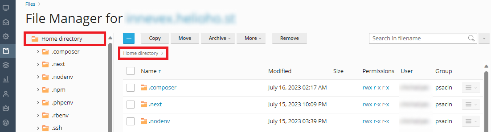
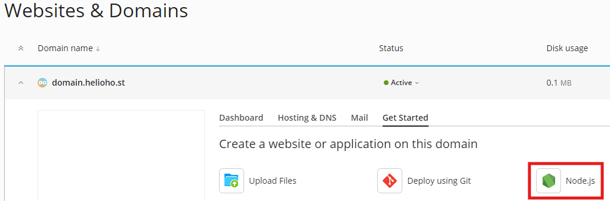
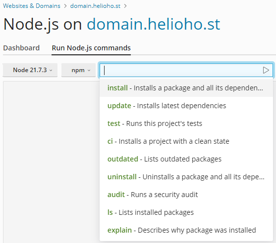

# Next.js

## About Next.js

[Next.js](https://nextjs.org/) is a popular full stack framework for Node.js, it uses React on the frontend and is packed with awesome features like server-side rendering. It also includes API routes and much more.

## Setup

Your Node.js files will go into your home directory (**NOT** `httpdocs`):



Go into your project root (if you don't have a project, the [Next.js website](https://nextjs.org/learn/) offers tutorials to guide you through creating one).

Create a new file called `start.js` and put this inside:

```javascript
const path = require('path');
const nextPath = path.join(__dirname, 'node_modules', '.bin', 'next');

process.argv.length = 1;
process.argv.push(nextPath, 'start');

require(nextPath);
```

## Server setup

Upload all your files to your server. 

In Plesk, go to: `Website & Domains > [domain]` 



Once in the Node.js section, set the following:

* Node.js Version: we recommend using [the latest available](README.md#supported-versions).
* Application Root: `/` (Folder where you uploaded your Next.js project, we recommend `/`)
* Application Startup File: `start.js` (the file created earlier).
* Custom environment variables: `PORT = 8888`
* Optionally: Custom environment variables: `NODE\_ENV = production`

## Starting the Server

Once all of the above steps are done, you can press the `Enable Node.js` button.

Then you need to run the `NPM install` command.



And then `Run script`, Script name: `build`

Finally, you will need to wait **up to 2 hours** for the server to update.


Node.js application deployment can take **up to 2 hours** to go into effect as it requires an Apache restart. After an entire 2 hours, if your Next.js app is not working for you, please [clear your web browser cache](../../misc/clear-your-cache.md).


## Further Support 

If it's been more than 2 hours, and the Next.js application still isn't working, please go back and check all of your steps again. If it's been more than a full 2 hours since your changes, and it still isn't working even after you [cleared your web browser cache](../misc/clear-your-cache.md), please make a new post in the [Customer Service forum](https://helionet.org/index/forum/45-customer-service/?do=add), making sure to provide your **username**, **domain**, and any **error message(s)** encountered.